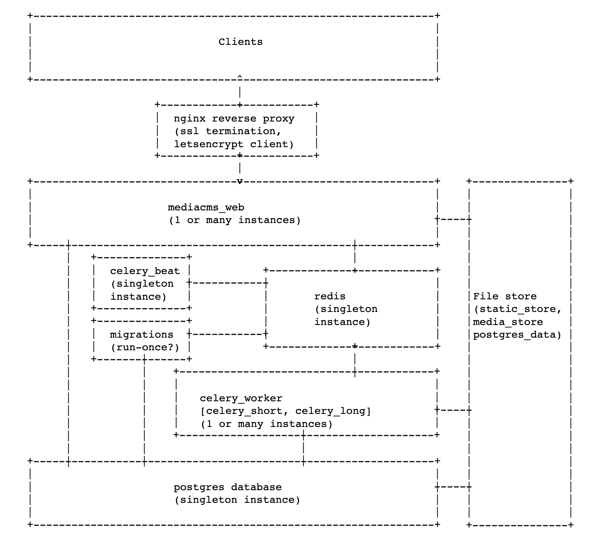

# MediaCMS on Docker

The mediacms image is built to use supervisord as the main process, which manages one or more services required to run mediacms. We can toggle which services are run in a given container by setting the environment variables below to `yes` or `no`:

* ENABLE_UWSGI
* ENABLE_NGINX
* ENABLE_CELERY_BEAT
* ENABLE_CELERY_SHORT
* ENABLE_CELERY_LONG
* ENABLE_MIGRATIONS

By default, all these services are enabled, but in order to create a scaleable deployment, some of them can be disabled, splitting the service up into smaller services.

Also see the `Dockerfile` for other environment variables which you may wish to override. Application settings, eg. `FRONTEND_HOST` can also be overridden by updating the `deploy/docker/local_settings.py` file.

See example deployments in the sections below. These example deployments have been tested on `docker-compose version 1.27.4` running on `Docker version 19.03.13`

To run, update the configs above if necessary, build the image by running `docker-compose build`, then run `docker-compose run`

## Simple Deployment, accessed as http://localhost

The main container runs migrations, mediacms_web, celery_beat, celery_workers (celery_short and celery_long services), exposed on port 80 supported by redis and postgres database. The FRONTEND_HOST in `deploy/docker/local_settings.py` is configured as http://localhost, on the docker host machine.

## Server with ssl certificate through letencrypt service, https://host.com
In this case the FRONTEND_HOST should be set to https://host.com. Uses [this deployment](../docker-compose-letsencrypt.yaml).
Also you have to set a valid email on that file, on settings `LETSENCRYPT_EMAIL`

## Advanced Deployment, accessed as http://localhost:8000

Here we can run 1 mediacms_web instance, with the FRONTEND_HOST in `deploy/docker/local_settings.py` configured as http://localhost:8000. This is bootstrapped by a single migrations instance and supported by a single celery_beat instance and 1 or more celery_worker instances. Redis and postgres containers are also used for persistence. Clients can access the service on http://localhost:8000, on the docker host machine. This is similar to [this deployment](../docker-compose.yaml), with a `port` defined in FRONTEND_HOST.

## Advanced Deployment, with reverse proxy, accessed as http://mediacms.io

Here we can use `jwilder/nginx-proxy` to reverse proxy to 1 or more instances of mediacms_web supported by other services as mentioned in the previous deployment. The FRONTEND_HOST in `deploy/docker/local_settings.py` is configured as http://mediacms.io, nginx-proxy has port 80 exposed. Clients can access the service on http://mediacms.io (Assuming DNS or the hosts file is setup correctly to point to the IP of the nginx-proxy instance). This is similar to [this deployment](../docker-compose-http-proxy.yaml).

## Advanced Deployment, with reverse proxy, accessed as https://localhost

The reverse proxy (`jwilder/nginx-proxy`) can be configured to provide SSL termination using self-signed certificates, letsencrypt or CA signed certificates (see: https://hub.docker.com/r/jwilder/nginx-proxy or [LetsEncrypt Example](https://www.singularaspect.com/use-nginx-proxy-and-letsencrypt-companion-to-host-multiple-websites/) ). In this case the FRONTEND_HOST should be set to https://mediacms.io. This is similar to [this deployment](../docker-compose-http-proxy.yaml).

## A Scaleable Deployment Architecture (Docker, Swarm, Kubernetes)

The architecture below generalises all the deployment scenarios above, and provides a conceptual design for other deployments based on kubernetes and docker swarm. It allows for horizontal scaleability through the use of multiple mediacms_web instances and celery_workers. For large deployments, managed postgres, redis and storage may be adopted.

